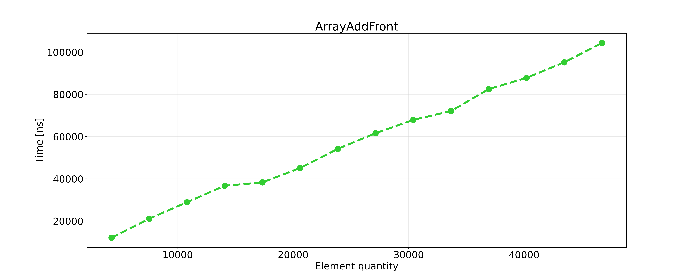
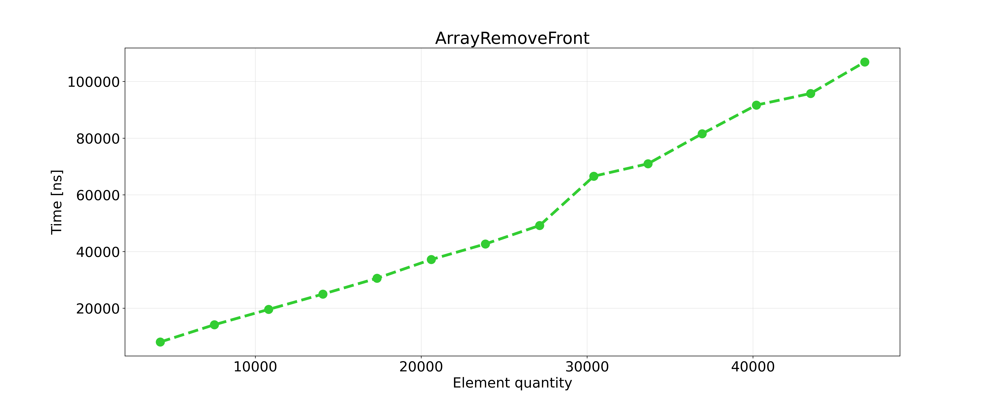
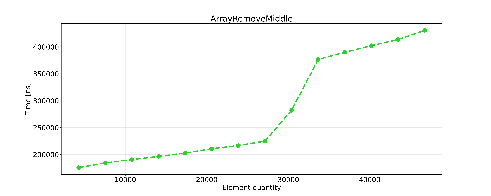
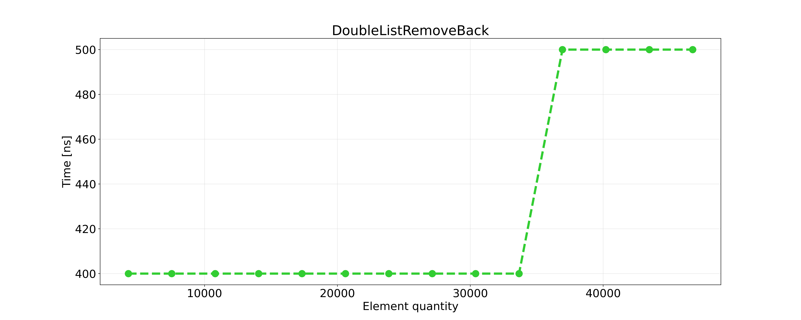
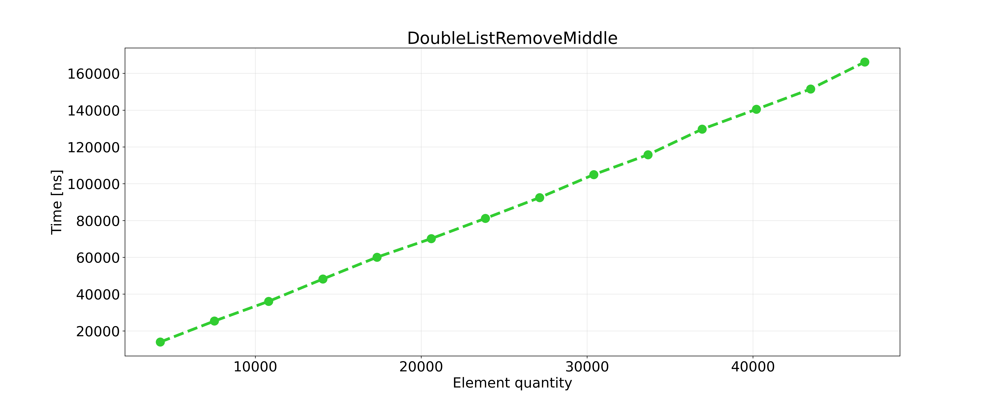
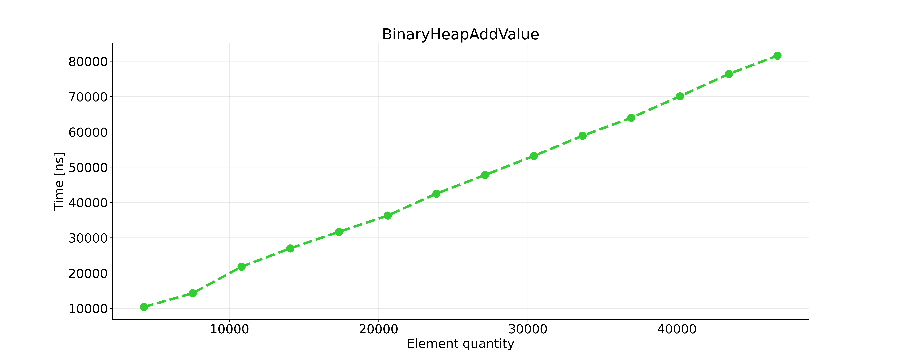
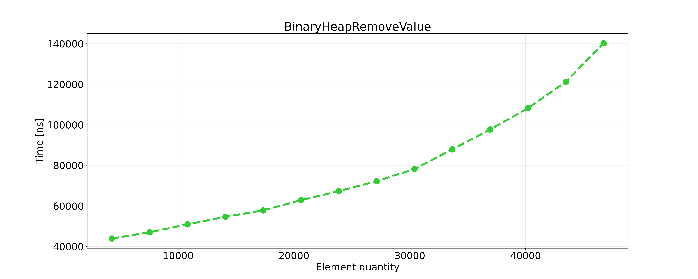
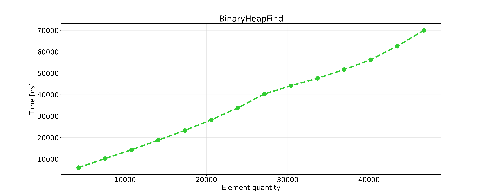
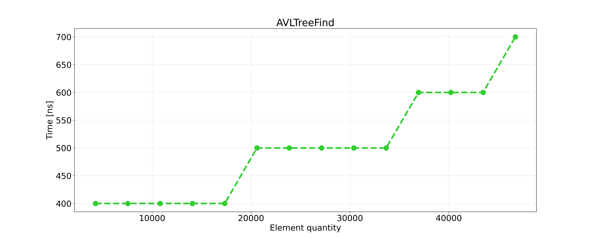

# Struktury Danych i Złożoność Obliczeniowa - Projekt: Sprawozdanie

| Wydział Elektroniki      | Kierunek: Informatyka Techniczna |
| :----------------------- | -------------------------------: |
| Grupa zajęciowa Wt 15:15 |          Semestr: 2020/2021 Lato |
| Prowadzący:              |         Dr inż. Dariusz Banasiak |

|     Autor     |
| :-----------: |
| Byczko Maciej |

## Wstęp

Zadanie projektowym było napisanie programu i zmierzenie czasu wykonywania działań na:

* Tablicy dynamicznej
* Liście dwukierunkowej
* Kopcu binarnym typu MAX
* drzewie czerwono-czarnym

Działania wykonywane na powyższych strukturach były następujące:

* Dodawanie
* Usuwanie
* Znajdowanie

## Założenia

* 4 bajtowa liczba całkowita ze znakiem (int w C++)
* wszystkie  struktury  danych  powinny  być  alokowane  dynamicznie
* należy zmierzyć czasy wykonywania poszczególnych operacji w funkcji rozmiaru danej struktury
* językami programowanie są języki kompilowane do kodu natywnego (C, Objective C, C++, Rust, GO)
* nie wolno korzystać z gotowych bibliotek np. STL, Boost lub innych – wszystkie algorytmy i struktury muszą być zaimplementowane przez studenta
* realizacja zadania powinna być wykonana w formie jednego programu
* kod źródłowy powinien być komentowany
* program musi skompilowany do wersji exe

### Dodatkowe funkcje

* utworzenie struktury na podstawie danych zapisanych w pliku tekstowym. Pierwsza liczba określa rozmiar  struktury,  następnie  należy  wprowadzić  odpowiednią  liczbę  danych  np.  każda  liczba  w osobnej linii
* wyświetlenie struktury na ekranie (w przypadku drzew zaproponować odpowiednią formę, która uwzględni relacje między elementami tej struktury)
* możliwość  wykonania  wszystkich  przewidzianych  operacji  na  danej  strukturze  (wybór  operacji najlepiej zrealizować w formie menu)

## Złożoności obliczeniowe

### Ogólne informacje

Złożoność obliczeniowa jest nam potrzebna aby określić ilość zasobów potrzebnych do rozwiązania problemu obliczeniowego.
Rozważanymi zasobami są głównie:

* Czas (Czasowa złożoność obliczeniowa)- ilość czasu potrzebna do wykonania algorytmu
* Pamięć (Pamięciowa złożoność obliczeniowa)- ilość pamięci wykorzystanej w celu realizacji algorytmu

### Złożoność tablicy dynamicznej

| Funkcja     | Średnia | Pesymistyczna |
| :---------- | :-----: | :-----------: |
| Dodawanie   | $O(n)$  |    $O(n)$     |
| Usuwanie    | $O(n)$  |    $O(n)$     |
| Znajdowanie | $O(n)$  |    $O(n)$     |

### Złożoność listy dwukierunkowej

| Funkcja     | Średnia | Pesymistyczna |
| :---------- | :-----: | :-----------: |
| Dodawanie   | $O(-)$  |    $O(n)$     |
| Usuwanie    | $O(-)$  |    $O(n)$     |
| Znajdowanie | $O(n)$  |    $O(n)$     |

### Złożoność kopca binarnego

| Funkcja     | Średnia | Pesymistyczna |
| :---------- | :-----: | :-----------: |
| Dodawanie   | $O(1)$  |    $O(1)$     |
| Usuwanie    | $O(1)$  |    $O(1)$     |
| Znajdowanie | $O(n)$  |    $O(n)$     |

### Złożoność drzewa czerwono-czarnego

| Funkcja     |   Średnia    | Pesymistyczna |
| :---------- | :----------: | :-----------: |
| Dodawanie   | $O(/log(n))$ | $O(/log(n))$  |
| Usuwanie    | $O(/log(n))$ | $O(/log(n))$  |
| Znajdowanie | $O(/log(n))$ | $O(/log(n))$  |

## Plan eksperymentu

### Informacje ogólne

* Pomiar czasu podczas dodawania elementów od 1000 do 45000
* Funkcja mierząca czas: `std::chrono::high_resolution_clock`
* Sposób generacji struktur:
  * Tworzenie struktury z losowymi danymi o podanym rozmiarze
  * Wykonanie operacji mierzonej
  * Zapisanie wyniku do pliku
  * Powtórzenie operacji (wartość zadana przez użytkownika)

### Pomiary czasowe

Pomiar czasowe były mierzone w **nanosekundach** $(1 [ns] = 1 * 10^9
[s])$ za pomocą następującej funkcji:

```cpp
template<typename T>
double Timer(T i) {
auto start = chrono::high_resolution_clock::now();// Start the counter
i();// our function
auto end = chrono::high_resolution_clock::now();// Get value after executing function
auto duration = end - start;// get time difference
auto elapsed_time = chrono::duration_cast<chrono::nanoseconds> (duration).count();// calculate time 
return elapsed_time;// Return executing time in nanoseconds
}
```

## Wyniki wykonanych eksperymentów

### Pomiary tablicy dynamicznej

#### Wyniki pomiarów tablicy

|      | Liczba danych | Dodawanie na początek | Dodawanie na koniec | Dodawanie gdziekolwiek | Usuwanie początek | Usuwanie koniec | Usuwanie gdziekolwiek | Szukanie |
| ---- | ------------- | --------------------- | ------------------- | ---------------------- | ----------------- | --------------- | --------------------- | -------- |
| L.p. | j             | $[ns]$                | $[ns]$              | $[ns]$                 | $[ns]$            | $[ns]$          | $[ns]$                | $[ns]$   |
| 1    | 5000          | 14200                 | 13400               | 208300                 | 10200             | 92700           | 175800                | 6200     |
| 2    | 10000         | 24800                 | 21000               | 219700                 | 18300             | 103700          | 185800                | 12100    |
| 3    | 15000         | 33400                 | 28100               | 231200                 | 27000             | 109600          | 196600                | 18900    |
| 4    | 20000         | 41100                 | 37200               | 240300                 | 34700             | 118300          | 203400                | 26600    |
| 5    | 25000         | 46900                 | 44700               | 251800                 | 43000             | 126300          | 215500                | 35300    |
| 6    | 30000         | 55100                 | 52000               | 266200                 | 51700             | 135300          | 266100                | 45200    |
| 7    | 35000         | 62200                 | 60200               | 395640                 | 59600             | 142800          | 360100                | 58000    |
| 8    | 40000         | 72800                 | 68600               | 413800                 | 67500             | 150900          | 376100                | 76000    |
| 9    | 45000         | 82000                 | 76400               | 428800                 | 75800             | 189700          | 389200                | 117400   |

#### Wykres dodawania elementu z przodu tablicy



#### Wykres dodawania elementu z tyłu tablicy


#### Wykres dodawania elementu w środku tablicy


#### Wykres usuwania elementu z przodu tablicy



#### Wykres usuwania elementu z tyłu tablicy


#### Wykres usuwania elementu w środku tablicy



#### Wykres znajdowania elementu w tablicy


#### Wnioski na temat tablicy

Czas wykonywania operacji wzrastał wraz z ilością elementów w tablicy, więc czas potrzebny na dodawanie, usuwanie bądź
znajdowanie elementu zależy od wielkości tej struktury. Wykresy są w większości funkcją liniową.

### Pomiary listy dwukierunkowej

#### Wyniki pomiarów listy

|      | Liczba danych | Dodawanie na początek | Dodawanie na koniec | Dodawanie gdziekolwiek | Usuwanie początek | Usuwanie koniec | Usuwanie gdziekolwiek | Szukanie |
| ---- | ------------- | --------------------- | ------------------- | ---------------------- | ----------------- | --------------- | --------------------- | -------- |
| L.p. | j             | $[ns]$                | $[ns]$              | $[ns]$                 | $[ns]$            | $[ns]$          | $[ns]$                | $[ns]$   |
| 1    | 5000          | 300                   | 21100               | 19500                  | 100               | 400             | 19400                 | 200      |
| 2    | 10000         | 300                   | 43940               | 36900                  | 100               | 400             | 36000                 | 3800     |
| 3    | 15000         | 400                   | 65660               | 52900                  | 100               | 400             | 52800                 | 3900     |
| 4    | 20000         | 400                   | 88800               | 70800                  | 100               | 400             | 69400                 | 20480    |
| 5    | 25000         | 400                   | 112700              | 86500                  | 100               | 400             | 85800                 | 55700    |
| 6    | 30000         | 400                   | 141100              | 100500                 | 100               | 400             | 02000                 | 99200    |
| 7    | 35000         | 400                   | 156400              | 117000                 | 100               | 400             | 18900                 | 156300   |
| 8    | 40000         | 400                   | 180700              | 133100                 | 100               | 400             | 35900                 | 216000   |
| 9    | 45000         | 400                   | 198900              | 149800                 | 100               | 500             | 55900                 | 277400   |

#### Wykres dodawania elementu z przodu listy


#### Wykres dodawania elementu z tyłu listy


#### Wykres dodawania elementu w środku listy


#### Wykres usuwania elementu z przodu listy


#### Wykres usuwania elementu z tyłu listy



#### Wykres usuwania elementu w środku listy



#### Wykres znajdowania elementu w liście


#### Wnioski na temat listy

Zgodnie z przewidywaniami czas operacji na przodzie tablicy był wręcz zerowy niezależnie od ilości elementów, reszta operacji była głównie liniowa.

### Pomiary kopca binarnego

#### Wyniki pomiarów kopca

|      | Liczba danych | Dodawanie | Usuwanie | Szukanie |
| ---- | ------------- | --------- | -------- | -------- |
| L.p. | j             | $[ns]$    | $[ns]$   | $[ns]$   |
| 1    | 5000          | 11600     | 44800    | 7900     |
| 2    | 10000         | 20400     | 49100    | 14000    |
| 3    | 15000         | 27500     | 55000    | 20300    |
| 4    | 20000         | 35200     | 61400    | 27300    |
| 5    | 25000         | 42900     | 67600    | 36000    |
| 6    | 30000         | 51700     | 75400    | 43000    |
| 7    | 35000         | 59200     | 90300    | 48200    |
| 8    | 40000         | 67700     | 105100   | 54800    |
| 9    | 45000         | 76600     | 125400   | 63200    |

#### Dodawanie elementu w kopcu



#### Usuwanie elementu w kopcu



#### Znajdowanie elementu w kopcu



#### Wnioski na temat kopca

Zgodnie z przewidywaniami działania wykonywane na kopcu były funkcją liniową.

### Pomiary drzewa czerwono-czarnego

#### Wyniki pomiarów drzewa

|      | Liczba danych | Dodawanie | Usuwanie | Szukanie |
| ---- | ------------- | --------- | -------- | -------- |
| L.p. | j             | $[ns]$    | $[ns]$   | $[ns]$   |
| 1    | 5000          | 500       | 400      | 300      |
| 2    | 10000         | 600       | 400      | 400      |
| 3    | 15000         | 600       | 400      | 400      |
| 4    | 20000         | 600       | 500      | 400      |
| 5    | 25000         | 600       | 500      | 400      |
| 6    | 30000         | 700       | 600      | 400      |
| 7    | 35000         | 700       | 600      | 400      |
| 8    | 40000         | 700       | 700      | 500      |
| 9    | 45000         | 800       | 700      | 500      |

#### Dodawanie elementu w drzewie


#### Usuwanie elementu w drzewie


#### Znajdowanie elementu w drzewie


#### Wnioski na temat drzewa

Wykresy wyszły bardzo interesujące, widać wyraźnie momenty przejścia na dłuższe czasy wykonywania operacji lecz i tak wszystkie funkcje miały krótki czas wykonania.

### Pomiary drzewa AVL

#### Wyniki pomiarów drzewa AVL

|      | Liczba danych | Dodawanie | Usuwanie | Szukanie |
| ---- | ------------- | --------- | -------- | -------- |
| L.p. | j             | $[ns]$    | $[ns]$   | $[ns]$   |
| 1    | 5000          | 400       | 600      | 400      |
| 2    | 10000         | 500       | 700      | 400      |
| 3    | 15000         | 500       | 700      | 400      |
| 4    | 20000         | 600       | 800      | 400      |
| 5    | 25000         | 700       | 900      | 500      |
| 6    | 30000         | 700       | 900      | 500      |
| 7    | 35000         | 700       | 1000     | 500      |
| 8    | 40000         | 800       | 1100     | 600      |
| 9    | 45000         | 800       | 1200     | 700      |

#### Dodawanie elementu w drzewie AVL


#### Usuwanie elementu w drzewie AVL


#### Znajdowanie elementu w drzewie AVL



#### Wnioski na temat drzewa AVL

Podobnie do drzewa czerwono-czarnego na wykresach są widoczne sekcje, czasy wykonania są dłuższe ponieważ w drzewie AVL dodatkowo występuje balansowanie drzewa.

## Wnioski końcowe

Podsumowując wykonane pomiary większość wyszła zgodnie z przewidywaniami, w niektórych miejscach mamy dziwne przesunięcia, najprawdopodobniej jest to spowodowane:

* Słabo zoptymalizowane algorytmy
* Działanie innych programów podczas wykonywania pomiarów co spowodowało odchylenia i błędy pomiarowe

Eksperymenty wykazały, że najbardziej efektywną strukturą do przechowywania wartości jest drzewo czerwono-czarne gdyż ma najmniejsze czasy wykonywania operacji ze wszystkich struktur. (Nawet jeżeli lista dwukierunkowa ma wręcz zerowy czas operacji na elementach z przodu tablicy to i tak w większości przypadków potrzebujemy elementów z środkowych części struktury)
