# Struktury Danych i Złożoność Obliczeniowa - Projekt: Sprawozdanie

| Wydział Elektroniki      | Kierunek: Informatyka Techniczna |
| :----------------------- | -------------------------------: |
| Grupa zajęciowa Wt 15:15 |          Semestr: 2020/2021 Lato |
| Prowadzący:              |         Dr inż. Dariusz Banasiak |

|        Autor         |
| :------------------: |
| Byczko Maciej 252747 |

## Wstęp

Zadanie projektowym było napisanie programu i zmierzenie czasu wykonywania działań na:

* Tablicy dynamicznej
* Liście dwukierunkowej
* Kopcu binarnym typu MAX
* drzewie czerwono-czarnym

Działania wykonywane na powyższych strukturach były następujące:

* Dodawanie
* Usuwanie
* Znajdowanie

## Założenia

* 4 bajtowa liczba całkowita ze znakiem (int w C++)
* wszystkie struktury danych powinny być alokowane dynamicznie
* należy zmierzyć czasy wykonywania poszczególnych operacji w funkcji rozmiaru danej struktury
* językami programowanie są języki kompilowane do kodu natywnego (C, Objective C, C++, Rust, GO)
* nie wolno korzystać z gotowych bibliotek np. STL, Boost lub innych – wszystkie algorytmy i struktury muszą być
  zaimplementowane przez studenta
* realizacja zadania powinna być wykonana w formie jednego programu
* kod źródłowy powinien być komentowany
* program musi skompilowany do wersji exe

### Dodatkowe funkcje

* utworzenie struktury na podstawie danych zapisanych w pliku tekstowym. Pierwsza liczba określa rozmiar struktury,
  następnie należy wprowadzić odpowiednią liczbę danych np. każda liczba w osobnej linii
* wyświetlenie struktury na ekranie (w przypadku drzew zaproponować odpowiednią formę, która uwzględni relacje między
  elementami tej struktury)
* możliwość wykonania wszystkich przewidzianych operacji na danej strukturze  (wybór operacji najlepiej zrealizować w
  formie menu)
* Projekt został napisany w języku C++ w standardzie C++20
* Do pisania oraz kompilacji zostało użyte środowisko CLion
* Wykresy oraz dane zostały przetworzone za pomocą skryptu napisanego w Pythonie w wersji 3.9.4
* Losowe dane do losowych struktur są generowane za pomocą funkcji rand()
* Wyniki zostały uśrednione za pomocą biblioteki statistics w Pythonie

## Złożoności obliczeniowe

### Ogólne informacje

Złożoność obliczeniowa jest nam potrzebna aby określić ilość zasobów potrzebnych do rozwiązania problemu obliczeniowego.
Rozważanymi zasobami są głównie:

* Czas (Czasowa złożoność obliczeniowa)- ilość czasu potrzebna do wykonania algorytmu
* Pamięć (Pamięciowa złożoność obliczeniowa)- ilość pamięci wykorzystanej w celu realizacji algorytmu

Dla każdego algorytmu można wyróżnić trzy typy złożoności:

* Optymistyczna - Najkrótszy możliwy czas wykonania algorytmu dla najkorzystniejszego zbioru danych (nie będę jej
  umieszczał w tabelach ponieważ wynosi ona zawsze O(-) (Dodanie elementu do pustej struktury))
* Średnia - Typowe zużycie zasobów dla losowego zbioru danych
* Pesymistyczna - Najdłuższy czas wykonania algorytmu dla najmniej korzystnego zbioru danych

W tabelach litera **n** oznacza ilość elementów w strukturze

### Złożoność tablicy dynamicznej

| Funkcja     | Średnia | Pesymistyczna |
| :---------- | :-----: | :-----------: |
| Dodawanie   | $O(n)$  |    $O(n)$     |
| Usuwanie    | $O(n)$  |    $O(n)$     |
| Znajdowanie | $O(n)$  |    $O(n)$     |
| Dostęp      | $O(1)$  |    $O(n)$     |

### Złożoność listy dwukierunkowej

| Funkcja     | Średnia | Pesymistyczna |
| :---------- | :-----: | :-----------: |
| Dodawanie   | $O(1)$  |    $O(n)$     |
| Usuwanie    | $O(1)$  |    $O(n)$     |
| Znajdowanie | $O(n)$  |    $O(n)$     |
| Dostęp      | $O(n)$  |    $O(n)$     |

### Złożoność kopca binarnego

| Funkcja     |   Średnia    | Pesymistyczna |
| :---------- | :----------: | :-----------: |
| Dodawanie   | $O(\log(n))$ |    $O(n)$     |
| Usuwanie    | $O(\log(n))$ |    $O(n)$     |
| Znajdowanie |    $O(n)$    |    $O(n)$     |

### Złożoność drzewa czerwono-czarnego

| Funkcja     |   Średnia    | Pesymistyczna |
| :---------- | :----------: | :-----------: |
| Dodawanie   | $O(\log(n))$ | $O(\log(n))$  |
| Usuwanie    | $O(\log(n))$ | $O(\log(n))$  |
| Znajdowanie | $O(\log(n))$ | $O(\log(n))$  |

## Plan eksperymentu

### Informacje ogólne

* Pomiar czasu podczas dodawania elementów od 1000 do 45000

* Funkcja mierząca czas: `std::chrono::high_resolution_clock`

* Sposób generacji struktur:

  * Tworzenie struktury z losowymi danymi o podanym rozmiarze

  * Wykonanie operacji mierzonej

  * Zapisanie wyniku do pliku

  * Powtórzenie operacji (wartość zadana przez użytkownika)

### Pomiary czasowe

Pomiar czasowe były mierzone w **nanosekundach** $(1 [ns] = 1 * 10^9 [s])$ za pomocą następującej funkcji:

```cpp
template<typename T>
double Timer(T i) {
auto start = chrono::high_resolution_clock::now();// Start the counter
i();// our function
auto end = chrono::high_resolution_clock::now();// Get value after executing function
auto duration = end - start;// get time difference
auto elapsed_time = chrono::duration_cast<chrono::nanoseconds> (duration).count();// calculate time 
return elapsed_time;// Return executing time in nanoseconds
}
```

## Wyniki wykonanych eksperymentów

### Pomiary tablicy dynamicznej

#### Opis ogólny operacji na tablicy

Jedna z najprostszych struktur – jest ona zbiorem elementów z przypisanym indeksem który zależy od jej kolejności w
strukturze – każdy element ma swój indeks. W tym przypadku będzie to tablica dynamiczna której wielkość może być
dowolnie zadawana i zmieniana operacjami. Ważna jest tutaj relokacja pamięci – swoiste zbudowanie tablicy od nowa po
wykonaniu operacji aby ‘odświeżyć’ zawartość tablicy.

* Dodawanie na początku - Najpierw wymagane jest zwiększenie indeksu liczby elementów w tablicy o jeden, a następnie
  przesunięcie ich wszystkich o adres wyżej, tak aby pierwsze miejsce (początek) było puste. W to miejsce też (używając
  adresu początka tablicy) wstawiamy zadaną wartość.

* Dodawanie na końcu - Podobnie jak wyżej liczba elementów zostaje zwiększona o jeden jednak przesuwanie nie jest
  wymagane gdyż nowo stworzony indeks jest ‘pusty’ – tam wstawiamy zadaną wartość.

* Dodawanie w wybranym miejscu - Zwiększenie ilości elementu o jeden, a następnie iteracja do podanego indeksu, po
  wstawieniu elementu następuje operacja wpisania do pozostałych pól wartości ze starej tablicy

* Usuwanie z początku tablicy - Operacja ta wpierw usuwa wartość z pierwszej komórki tablicy, a następnie przesuwa
  wszystkie pozostałe elementy wstecz. Wtedy ostatnia komórka jest pusta i zostaje usunięta, zmniejszając liczbę
  elementów o jeden.

* Usuwanie z końca tablicy - Usuwa ostatni element z tablicy, zmniejszając liczbę elementów o jeden.

* Usuwanie z wybranego miejsca - Szukamy zadanego indeksu z następnie usuwamy z niego wartość. Potem wszystkie elementy
  powyżej są przesuwane do tyłu, a ostatnia (pusta) komórka jest usuwana zmniejszając liczbę elementów.

* Wyszukiwanie:

  * Wartości - Przeszukuje wszystkie indeksy od początku i sprawdza ich wartość z zadaną. Jeśli element został
      znaleziony – daje komunikat i wartość indeksu pod którą się znajduje. Jeśli element nie istnieje lub jest na końcu
      złożoność czasowa jest równa O(n) gdzie n to liczba elementów tablicy. W innym przydatku jest zależna od pozycji
      szukanego klucza.

  * Indeksu - Rzuca wartość znajdującą się pod danym indeksem, w innym przypadku rzuca bool=false

#### Wyniki pomiarów tablicy

|      | Liczba danych | Dodawanie na koniec | Dodawanie na początek | Dodawanie gdziekolwiek | Szukanie  | Usuwanie koniec | Usuwanie początek | Usuwanie gdziekolwiek |
| ---- | ------------- | ------------------- | --------------------- | ---------------------- | --------- | --------------- | ----------------- | --------------------- |
| L.p. | j             | $[ns]$              | $[ns]$                | $[ns]$                 | $[ns]$    | $[ns]$          | $[ns]$            | $[ns]$                |
|      |               | ArrayAddBack        | ArrayAddFront         | ArrayAddMiddle         | ArrayFind | ArrayRemoveBack | ArrayRemoveFront  | ArrayRemoveMiddle     |
| 1    | 1000          | 3300                | 5500                  | 195300                 | 1000      | 84500           | 3202              | 165800                |
| 2    | 5000          | 9000                | 10300                 | 204100                 | 5100      | 90600           | 8900              | 172300                |
| 3    | 10000         | 17900               | 19300                 | 215600                 | 11100     | 99600           | 17700             | 183400                |
| 4    | 15000         | 25600               | 28000                 | 227300                 | 17600     | 107500          | 25700             | 192600                |
| 5    | 20000         | 34300               | 36300                 | 238700                 | 24900     | 116100          | 33300             | 203000                |
| 6    | 30000         | 51500               | 54600                 | 262400                 | 44700     | 133100          | 50900             | 258500                |
| 7    | 35000         | 60100               | 63800                 | 400900                 | 57500     | 141700          | 59300             | 366600                |
| 8    | 40000         | 68300               | 71300                 | 415900                 | 74400     | 151000          | 66800             | 381300                |
| 9    | 45000         | 74900               | 77300                 | 431200                 | 116800    | 158000          | 75700             | 395000                |
| 10   | 50000         | 86600               | 97500                 | 520796                 | 202993    | 214198          | 87698             | 466100                |

#### Wykres dodawania elementu z przodu tablicy


#### Wykres dodawania elementu z tyłu tablicy

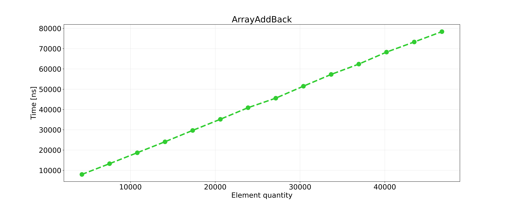

#### Wykres dodawania elementu w środku tablicy

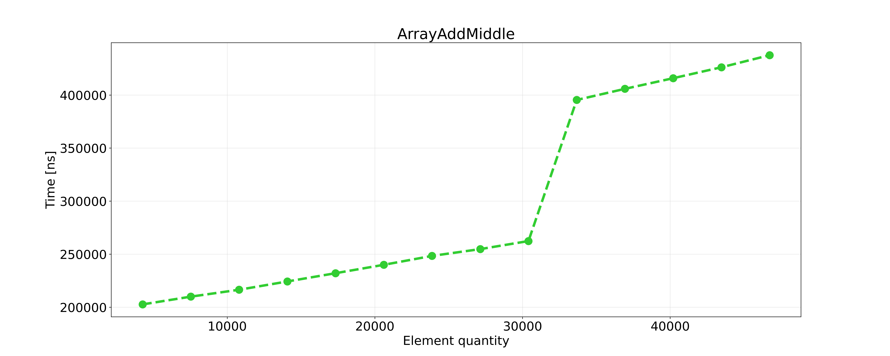

#### Wykres usuwania elementu z przodu tablicy

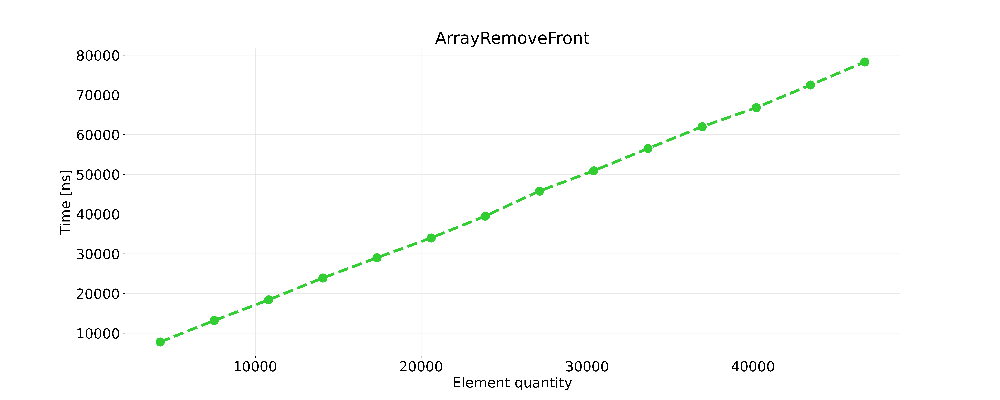

#### Wykres usuwania elementu z tyłu tablicy

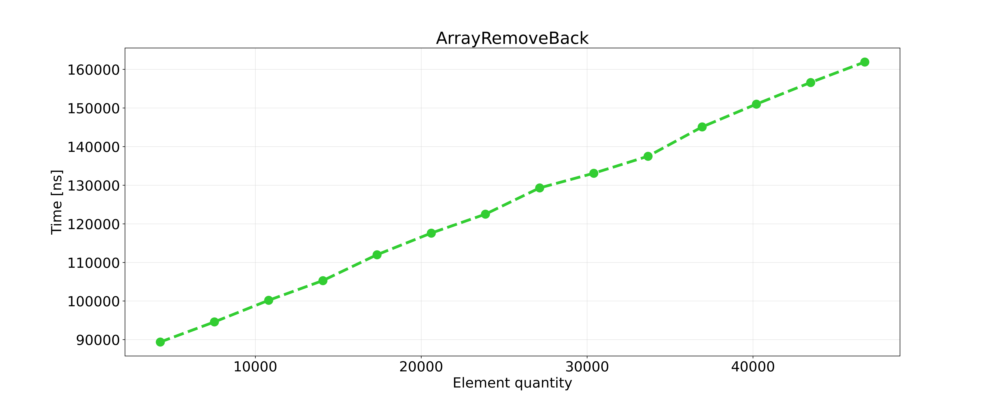

#### Wykres usuwania elementu w środku tablicy


#### Wykres znajdowania elementu w tablicy

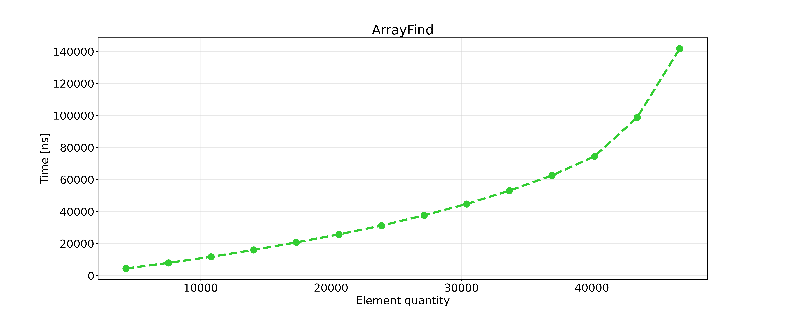

#### Wnioski na temat tablicy

Czas wykonywania operacji wzrastał wraz z ilością elementów w tablicy, więc czas potrzebny na dodawanie, usuwanie bądź
znajdowanie elementu zależy od wielkości tej struktury. Wykresy są w większości funkcją liniową.

### Pomiary listy dwukierunkowej

#### Opis ogólny operacji na liście dwukierunkowej

Lista jest podobna do tablicy – jest to ciąg elementów ustawionych w szereg. Każdy element tablicy posiada dwa wskaźniki
– na element znajdujący się przed i za nim w liście. Pierwszy element ma wskaźnik na poprzedni element warty NULL a więc
wskazuje na ‘nic’ , tak samo jest w przypadku ostatniego elementu listy którego wskaźnik na następny element też jest
równy NULL.

* Dodawanie na początek listy - Tworzony jest nowy element o zadanej wartości, do którego wskaźnika na element poprzedni
  wstawiamy NULL, a dla obecnego pierwszego elementu do wskaźnika na element poprzedni wstawiamy adres nowego elementu,
  by wreszcie przypisać nowemu elementowi status "głowy". Zwiększamy liczbę elementów. Jeśli lista była pusta to nowy
  element jest jednocześnie głową i ogonem.

* Dodawanie na koniec listy - Iterujemy na koniec listy, następnie gdy dojdziemy do ostatniego elementu dajemy mu
  wskaźnik na nasz nowo dodany element a nasz element dostaje wskaźnik na były ostatni element.

* Dodawanie na wybrane miejsce - Tworzymy nowy element i w adresie poprzednika wstawiamy adres elementu będącego na
  podanym adresie, a do adresu następcy – adres elementu będącego następcą elementu o zadanym adresie. Następnie
  zmieniamy adresy następcy (dla elementu o wybranym adresie) i poprzednika (dla elementu będącym następcą nowego
  elementu) aby wskazywały na nowy element i zwiększamy liczbę elementów.

* Usuwanie z początku listy - Zamieniamy status "głowy" z elementu pierwszego na element następny. Do adresu poprzednika
  nowej głowy wstawiamy adres NULL. Usuwamy niepotrzebny element z pamięci i zmniejszamy liczbę elementów.

* Usuwanie z końca listy - Iterujemy na ostatni element listy, usuwamy ostatni element a przedostatniemu dajemy wskaźnik
  na ostatni element = NULL.

* Usuwanie z wybranego miejsca - Do adresu następcy elementu o wybranym elemencie wstawiamy adres poprzednika wybranego
  elementu. Do adresu poprzednika elementu występującego po wybranym wstawiamy taki sam adres jaki posiadał usuwany
  element. Potem usuwamy z pamięci niepotrzebny element i zmniejszamy licznik elementów.

* Wyszukiwanie - Poczynając od głowy przeszukujemy zawartości komórek (klucze) pod kątem szukanej wartości. Przechodząc
  z elementu na element posługujemy się wskaźnikami zawierającymi adres następnego elementu. Operacja zwraca wskaźnik na
  nasz szukany element bądź wartość NULL.

#### Wyniki pomiarów listy

|      | Liczba danych | Dodawanie na koniec | Dodawanie na początek | Dodawanie gdziekolwiek | Szukanie       | Usuwanie koniec      | Usuwanie początek     | Usuwanie gdziekolwiek  |
| ---- | ------------- | ------------------- | --------------------- | ---------------------- | -------------- | -------------------- | --------------------- | ---------------------- |
| L.p. | j             | $[ns]$              | $[ns]$                | $[ns]$                 | $[ns]$         | $[ns]$               | $[ns]$                | $[ns]$                 |
|      |               | DoubleListAddBack   | DoubleListAddFront    | DoubleListAddMiddle    | DoubleListFind | DoubleListRemoveBack | DoubleListRemoveFront | DoubleListRemoveMiddle |
| 1    | 1000          | 400                 | 400                   | 4600                   | 2600           | 400                  | 200                   | 4500                   |
| 2    | 5000          | 400                 | 400                   | 15900                  | 14700          | 400                  | 300                   | 15800                  |
| 3    | 10000         | 400                 | 400                   | 33700                  | 35000          | 400                  | 300                   | 33600                  |
| 4    | 15000         | 400                 | 400                   | 50900                  | 55800          | 400                  | 300                   | 49900                  |
| 5    | 20000         | 400                 | 400                   | 66800                  | 79100          | 400                  | 300                   | 66800                  |
| 6    | 30000         | 500                 | 500                   | 105000                 | 142500         | 500                  | 300                   | 100900                 |
| 7    | 35000         | 500                 | 500                   | 121200                 | 183900         | 500                  | 300                   | 117200                 |
| 8    | 40000         | 500                 | 500                   | 137800                 | 244160         | 500                  | 400                   | 133900                 |
| 9    | 45000         | 500                 | 500                   | 151300                 | 383400         | 500                  | 400                   | 150400                 |
| 10   | 50000         | 600                 | 700                   | 171000                 | 735800         | 700                  | 400                   | 169100                 |

#### Wykres dodawania elementu z przodu listy


#### Wykres dodawania elementu z tyłu listy

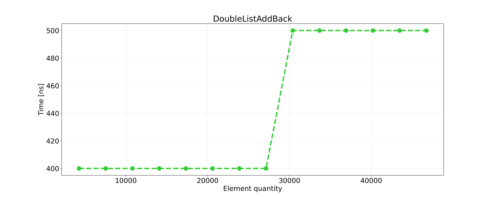

#### Wykres dodawania elementu w środku listy


#### Wykres usuwania elementu z przodu listy

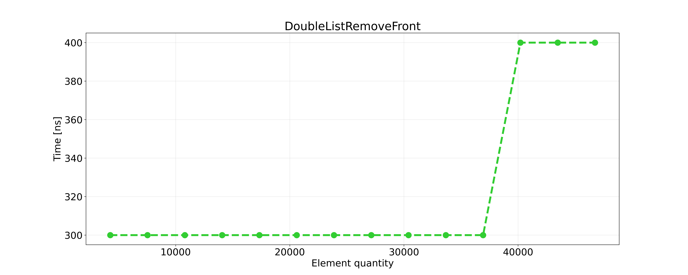

#### Wykres usuwania elementu z tyłu listy


#### Wykres usuwania elementu w środku listy

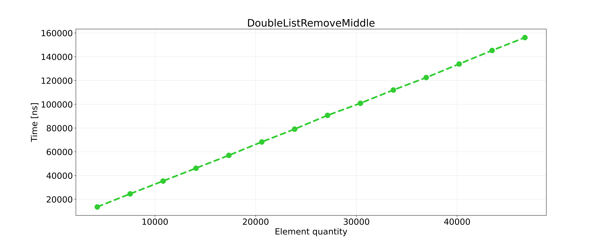

#### Wykres znajdowania elementu w liście


#### Wnioski na temat listy

Zgodnie z przewidywaniami czas operacji na przodzie tablicy był wręcz zerowy niezależnie od ilości elementów, reszta
operacji była głównie liniowa.

### Pomiary kopca binarnego

#### Opis ogólny operacji na kopcu binarnym typu maksimum

Tablicowa struktura danych reprezentująca drzewo binarne, którego wszystkie poziomy z wyjątkiem ostatniego muszą być
pełne. W przypadku, gdy ostatni poziom drzewa nie jest pełny, liście ułożone są od lewej do prawej strony drzewa. W
kopcu typu MAX wartość danego węzła niebędącego korzeniem jest zawsze mniejsza niż wartość jego rodzica.

* Dodawanie elementu - Dodawany element jest umieszczany na ostatniej pozycji w tablicy reprezentującej kopiec, a więc
  jako najmniejszy ‘liść’. Potem jego wartość jest sprawdzana z wartością rodzica i jeśli jest od niej większy –
  zamieniamy the elementy miejscami. Idziemy tak długo aż warunek nie zostanie spełniony. Budujemy kopiec od nowa
  korzystając z nowej tablicy.

* Usuwanie elementu - Wyrzucamy dany element z tabeli i ponownie budujemy kopiec z nowych wartości (przypisanych do
  nowych indeksów). W najgorszym przypadku jest to wyrzucenie korzenia co oznacza zamianę pozycji wszystkich elementów.

* Wyszukiwanie zadanej wartości - Wyszukiwanie elementu nie różni się niczym od innych struktur opartych na tabeli -
  Operacja zwraca wartość indeksu pod którą znajduje się wartość bądź liczbę -1.

#### Wyniki pomiarów kopca

|      | Liczba danych | Dodawanie | Szukanie | Usuwanie |
| ---- | ------------- | --------- | -------- | -------- |
| L.p. | j             | $[ns]$    | $[ns]$   | $[ns]$   |
| 1    | 1000          | 3400      | 2000     | 40500    |
| 2    | 5000          | 9600      | 6700     | 43500    |
| 3    | 10000         | 23000     | 13200    | 48400    |
| 4    | 15000         | 29300     | 19700    | 54000    |
| 5    | 20000         | 35700     | 26600    | 59700    |
| 6    | 30000         | 51600     | 42500    | 74800    |
| 7    | 35000         | 59300     | 48300    | 89800    |
| 8    | 40000         | 68900     | 54700    | 104900   |
| 9    | 45000         | 77000     | 63800    | 125200   |
| 10   | 50000         | 95298     | 75600    | 170098   |

#### Dodawanie elementu w kopcu

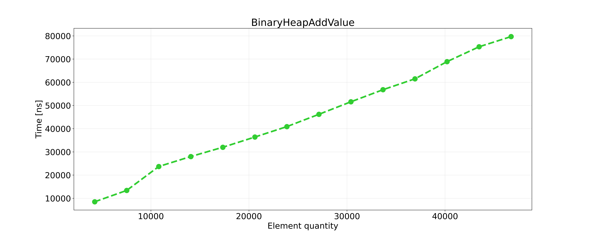

#### Usuwanie elementu w kopcu

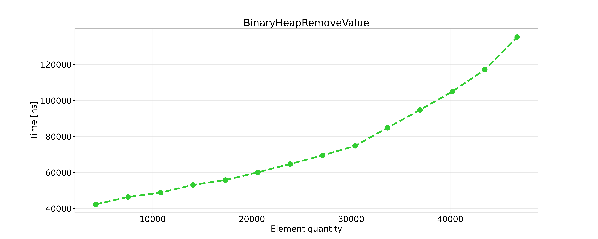

#### Znajdowanie elementu w kopcu


#### Wnioski na temat kopca

Można zauważyć że złożoność dodawania oraz odejmowania jest zawsze złożonością pesymistyczną, jest tak dlatego, że
kopiec został zaimplementowany jako tablica, więc przy usuwaniu oraz przy dodawaniu jest za każdym razem tworzona nowa
tablica.

### Pomiary drzewa czerwono-czarnego

#### Opis ogólny operacji na drzewie czerwono-czarnym

Rodzaj samoorganizującego się binarnego drzewa poszukiwań. W porównaniu do zwykłego drzewa binarnego posiada ono
dodatkowo parametr koloru za pomocą którego balansujemy drzewo. Podstawowymi zasadami drzewa czerwono-czarnego są:

* Każdy węzeł posiada kolor - czarny bądź czerwony
* Korzeń jest koloru czarnego
* Każdy liść (NULL) jest czarny
* Dla czerwonego węzła obydwoje dzieci jest czarnych
* Każda ścieżka od ustalonego węzła do liścia musi zawierać tą samą ilość czarnych węzłów

* Dodanie elementu - W odróżnieniu od drzew BST, wstawiając element musimy pamiętać, aby zachować zrównoważenie drzewa.
  Wstawienie elementu w dowolnym miejscu może powodować zaburzenie struktury kolorystycznej drzewa. Aby uniknąć pomyłek
  należy zastosować następujący algorytm:

1.Początkowo wstawiamy element tak, jak do standardowego drzewa BST. 2.Kolor każdego nowo dodanego elementu jest
czerwony. 3.Jeżeli rodzic wstawionego węzła jest czarny to własność drzewa została zachowana. 4.Jeżeli rodzic
wstawionego węzła jest czerwony to własność 3 została zaburzona (rodzic i syn mają kolor czerwony). Aby przywrócić
własność należy przekolorować wybrane węzły i zmienić relację między konfliktującymi węzłami.

* Usunięcie elementu - Podobnie, jak w przypadku wstawiania, usuwanie wymaga dodatkowej uwagi w celu zachowania
  zrównoważenia drzewa. Tym razem, zamiast martwić się o rodzica wstawianego elementu, skupić należy uwagę na kolorze
  usuwanego węzła. Należy pamiętać, że jeżeli usuwany wierzchołek jest czerwony, czarna wysokość drzewa nie jest
  zakłócona, natomiast jeżeli usuwany wierzchołek jest czarny należy naprawić wysokość dla każdej ścieżki w drzewie.

* Wyszukanie wartości - Wyszukiwanie elementu o kluczu k odbywa się tak samo jak wyszukiwanie w standardowym drzewie
  BST. Funkcja wyszukująca jako parametry przyjmuje wskaźnik do korzenia drzewa oraz wartość do znalezienia. Funkcja
  bool zwraca prawdę, jeżeli element został znaleziony, lub fałsz, jeżeli nie występuje w drzewie.

#### Wyniki pomiarów drzewa

|      | Liczba danych | Dodawanie | Szukanie | Usuwanie |
| ---- | ------------- | --------- | -------- | -------- |
| L.p. | j             | $[ns]$    | $[ns]$   | $[ns]$   |
| 1    | 1000          | 500       | 300      | 400      |
| 2    | 5000          | 500       | 400      | 400      |
| 3    | 10000         | 600       | 400      | 400      |
| 4    | 15000         | 600       | 400      | 500      |
| 5    | 20000         | 600       | 400      | 500      |
| 6    | 30000         | 600       | 400      | 600      |
| 7    | 35000         | 700       | 500      | 600      |
| 8    | 40000         | 700       | 500      | 700      |
| 9    | 45000         | 700       | 500      | 700      |
| 10   | 50000         | 1100      | 700      | 900      |

#### Dodawanie elementu w drzewie

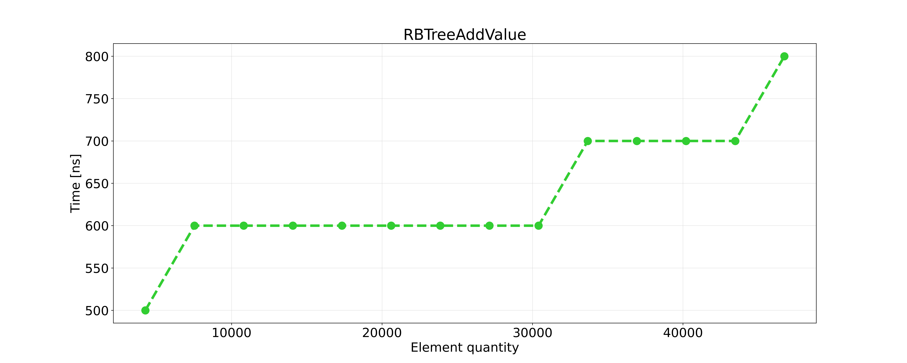

#### Usuwanie elementu w drzewie

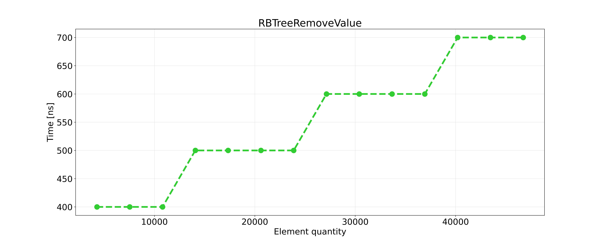

#### Znajdowanie elementu w drzewie


#### Wnioski na temat drzewa

Wykresy wyszły bardzo interesujące, widać wyraźnie momenty przejścia na dłuższe czasy wykonywania operacji lecz i tak
wszystkie funkcje miały krótki czas wykonania.

### Pomiary drzewa AVL

#### Opis ogólny operacji na drzewie AVL

Nazywane również drzewem dopuszczalnym – zrównoważone binarne drzewo poszukiwań (BST), w którym wysokość lewego i
prawego poddrzewa każdego węzła różni się co najwyżej o jeden. Skrót AVL pochodzi od nazwisk rosyjskich matematyków:
Adelsona-Velskiego oraz Landisa. Aby osiągnąć warunek rożnicy co najwyżej o 1, drzewo AVL posiada zmodyfikowane
procedury wstawiania i usuwania węzłów. Równoważenie uzyskuje się poprzez odpowiednie rotacje w lewo i w prawo węzłów
drzewa na ścieżce w kierunku korzenia, jeśli został zaburzony warunek drzewa AVL (wysokości poddrzew różnią się co
najwyżej o 1) po wstawieniu nowego węzła lub po usunięciu istniejącego węzła. Koszty modyfikacji drzewa AVL są większe
niż innych drzew lecz mamy gwarancję że pesymistyczny czas wyszukiwania nigdy nie przekroczy $1.44log_2(n+2)-0.328$.

* Dodanie elementu - Wstawiamy element jak do zwykłego drzewa BST, następnie wykonujemy aktualizację wyważeń węzłów od
  wstawionego elementu korzenia. Jeżeli w danym węźle współczynnik wyważenia $|x| > 1$ to należy przywrócić właściwości
  drzewa rotacjami (max. potrzebne będą dwie rotacje)

* Usuwanie elementu - usuwamy element jak w zwykłym BST, wykonujemy wyważenie od rodzica do usuniętego elementu aż do
  korzenia. jeżeli współczynnik wyważenia $|x| > 1$ to należy przywrócić właściwości drzewa za pomocą rotacji.

* Wyszukanie wartości - Wyszukiwanie elementu o kluczu k odbywa się tak samo jak wyszukiwanie w standardowym drzewie
  BST. Funkcja wyszukująca jako parametry przyjmuje wskaźnik do korzenia drzewa oraz wartość do znalezienia. Funkcja
  bool zwraca wskaźnik na element, jeżeli wartość została znaleziona, lub NULL, jeżeli nie występuje w drzewie.

#### Wyniki pomiarów drzewa AVL

|      | Liczba danych | Dodawanie | Szukanie | Usuwanie |
| ---- | ------------- | --------- | -------- | -------- |
| L.p. | j             | $[ns]$    | $[ns]$   | $[ns]$   |
| 1    | 1000          | 300       | 300      | 500      |
| 2    | 5000          | 400       | 300      | 600      |
| 3    | 10000         | 500       | 400      | 600      |
| 4    | 15000         | 500       | 400      | 600      |
| 5    | 20000         | 600       | 400      | 600      |
| 6    | 30000         | 700       | 400      | 700      |
| 7    | 35000         | 700       | 400      | 800      |
| 8    | 40000         | 700       | 400      | 900      |
| 9    | 45000         | 800       | 500      | 900      |
| 10   | 50000         | 1000      | 600      | 1100     |

#### Dodawanie elementu w drzewie AVL

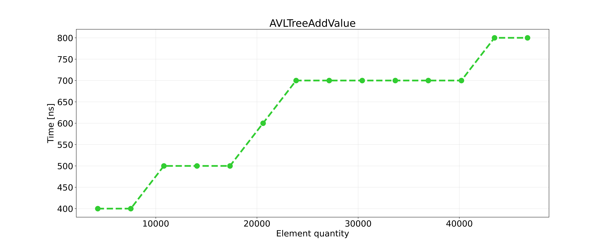

#### Usuwanie elementu w drzewie AVL

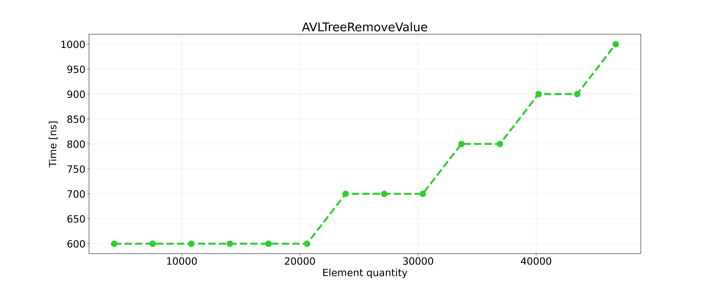

#### Znajdowanie elementu w drzewie AVL

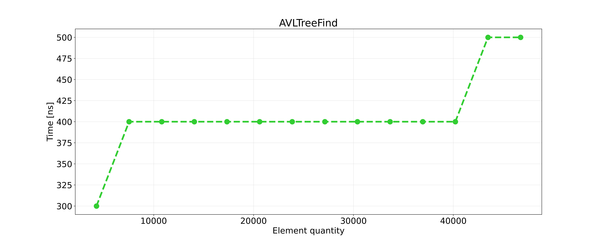

#### Wnioski na temat drzewa AVL

Podobnie do drzewa czerwono-czarnego na wykresach są widoczne sekcje, czasy wykonania są dłuższe ponieważ w drzewie AVL
dodatkowo występuje balansowanie drzewa.

## Wnioski końcowe

Podsumowując wykonane pomiary większość wyszła zgodnie z przewidywaniami, w niektórych miejscach mamy dziwne
przesunięcia, najprawdopodobniej jest to spowodowane:

* Słabo zoptymalizowane algorytmy

* Działanie innych programów podczas wykonywania pomiarów co spowodowało odchylenia i błędy pomiarowe

Eksperymenty wykazały, że najbardziej efektywną strukturą do przechowywania wartości jest drzewo czerwono-czarne gdyż ma
najmniejsze czasy wykonywania operacji ze wszystkich struktur. (Nawet jeżeli lista dwukierunkowa ma wręcz
infinitezymalny czas operacji na elementach z przodu tablicy to i tak w większości przypadków potrzebujemy elementów z
środkowych części struktury)

## Bibliografia

[Jarosław Mierzwa](http://jaroslaw.mierzwa.staff.iiar.pwr.wroc.pl/)

[Wikipedia - Array](https://en.wikipedia.org/wiki/Array_data_structure)

[Wikipedia - Double Linked List](https://en.wikipedia.org/wiki/Doubly_linked_list)

[Wikipedia - Red-Black Tree](https://en.wikipedia.org/wiki/Red-black_tree)

[Eduinf Waw - Red-Black Tree](https://eduinf.waw.pl/inf/alg/001_search/0121.php)

[Red-Black Tree Visualisation](https://www.cs.usfca.edu/~galles/visualization/RedBlack.html)

[Wikipedia - AVL Tree](https://en.wikipedia.org/wiki/AVL_tree)

[Eduinf Waw - AVL Tree](https://eduinf.waw.pl/inf/alg/001_search/0119.php)

[AVL Tree Visualisation](https://www.cs.usfca.edu/~galles/visualization/AVLtree.html)

[Chrono Clock](https://en.cppreference.com/w/cpp/chrono)

[Chrono High Resolution Clock](https://en.cppreference.com/w/cpp/chrono/high_resolution_clock)

[Python Pyplot](https://matplotlib.org/stable/tutorials/introductory/pyplot.html)

[Python Statistics](https://docs.python.org/3/library/statistics.html)

[Lambda in C++](https://en.cppreference.com/w/cpp/language/lambda)

[StackOverflow - Access violation reading location](https://stackoverflow.com/questions/10478941/0xc0000005-access-violation-reading-location-0x00000000)
