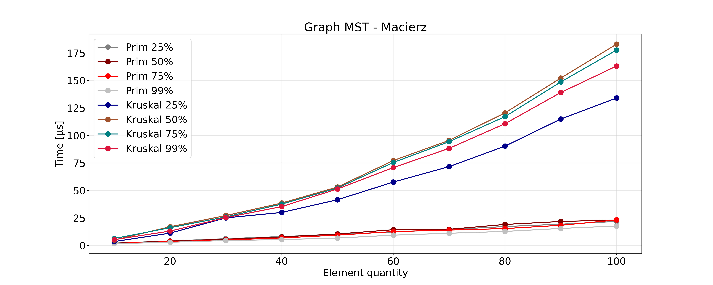

# Struktury Danych i Złożoność Obliczeniowa - Projekt: Sprawozdanie

| Wydział Elektroniki      | Kierunek: Informatyka Techniczna |
| :----------------------- | -------------------------------: |
| Grupa zajęciowa Wt 15:15 |          Semestr: 2020/2021 Lato |
| Prowadzący:              |         Dr inż. Dariusz Banasiak |

|        Autor         |
| :------------------: |
| Byczko Maciej 252747 |

## Wstęp

Zadanie projektowym było napisanie programu i zmierzenie czasu wykonywania działań na:

- Wyznaczaniu minimalnego drzewa rozpinającego za pomocą:
  - Algorytmu Prima
  - Algorytmu Kruskala
- Najkrótszą ścieżkę w grafie:
  - Algorytm Dijkstry
  - Algorytm Bellmana-Forda

Powyższe algorytmy były wykonywane na następujących strukturach:

- Macierz sąsiedztwa - macierz o wymiarze V x V (V - Liczba wierzchołków), w której wiersz oznacza wierzchołek początkowy, kolumna wierzchołek końcowy a w punkcie wspólnym znajduje się waga krawędzi, jeżeli w punkcie wspólnym występuje 0, oznacza to że nie ma połączenia z danymi wierzchołkami.
- Lista sąsiedztwa - graf zapisany jako V list, gdzie w każdej liście są przechowywane numery wierzchołków do których można się dostać z danego wierzchołka (przykładowo na liście 2 przechowywane są wierzchołki do których można się dostać z wierzchołka 2)

## Założenia

- wszystkie struktury danych powinny być alokowane dynamicznie,
- przepustowość/koszt krawędzi jest liczbą całkowitą (dodatnią),
- po zaimplementowaniu każdego z algorytmów dla obu reprezentacji grafu należy dokonać pomiaru czasu działania algorytmów w zależności od rozmiaru grafu oraz jego gęstości.
- Badania należy wykonać dla 5 różnych (reprezentatywnych) liczb wierzchołków V oraz następujących gęstości grafu: 25%, 50%, 75% oraz 99%. Dla każdego zestawu: reprezentacja, liczba wierzchołków i gęstość należy wygenerować serię losowych instancji (np. 20, 50 lub 100 w zależności od rozrzutu poszczególnych wyników), zaś w sprawozdaniu umieścić wyłącznie wyniki uśrednione z danej serii,
- program powinien umożliwić sprawdzenie poprawności zaimplementowanych operacji i zbudowanej struktury grafu (dodatkowe informacje w dalszej części dokumentu),
- językami programowanie są języki kompilowane do kodu natywnego (C, Objective C, C++, Rust, GO)
- implementacja projektu powinna być wykonana w formie jednego programu,
- nie wolno korzystać z gotowych bibliotek np. STL, Boost lub innych – wszystkie algorytmy i struktury muszą być zaimplementowane przez studenta
- kod źródłowy powinien być komentowany.
- realizacja zadania powinna być wykonana w formie jednego programu
- kod źródłowy powinien być komentowany
- program musi skompilowany do wersji exe

### Dodatkowe informacje

- utworzenie struktury na podstawie danych zapisanych w pliku tekstowym. Pierwsza liczba określa rozmiar struktury,
  następnie należy wprowadzić odpowiednią liczbę danych np. każda liczba w osobnej linii
- wyświetlenie struktury na ekranie
- możliwość wykonania wszystkich przewidzianych operacji na danej strukturze
- Projekt został napisany w języku C++ w standardzie C++20
- Do pisania oraz kompilacji zostało użyte środowisko CLion
- Wykresy oraz dane zostały przetworzone za pomocą skryptu napisanego w Pythonie w wersji 3.9.4
- Losowe dane do losowych struktur są generowane za pomocą biblioteki `random`
- Wyniki zostały uśrednione za pomocą biblioteki statistics w Pythonie

### Złożoność algorytmów

#### Reprezentacja za pomocą listy następników

| Algorytm     | Złożoność czasowa |
| :----------- | :---------------: |
| Prim         |   $O(E /log V)$   |
| Kruskal      |   $O(E /log E)$   |
| Dijkstra     |   $O(E /log V)$   |
| Bellman-Ford |  $O(E /cdot V)$   |

#### Reprezentacja za pomocą macierzy sąsiedztwa

| Algorytm     | Złożoność czasowa |
| :----------- | :---------------: |
| Prim         |     $O(V^2)$      |
| Kruskal      |   $O(E /log E)$   |
| Dijkstra     |   $O(E /log V)$   |
| Bellman-Ford |  $O(E /cdot V)$   |

## Plan eksperymentu

### Informacje ogólne

- Pomiar czasu podczas wykonywania algorytmów dla następujących parametrów grafów:

  - Rozmiary grafów od 10 do 100 wierzchołków (zwiększane co 10)
  - Badane gęstości: 25%, 50%, 75%, 99%

- Funkcja mierząca czas: `std::chrono::high_resolution_clock`

- Sposób generacji struktur:

  - Tworzenie struktury z losowymi danymi o podanym rozmiarze (każdy pomiar miał generowaną losową strukturę z zadanymi parametrami)

  - Wykonanie operacji mierzonej

  - Zapisanie wyniku do pliku

  - Powtórzenie operacji (wartość zadana przez użytkownika)

### Generowanie grafu

Dla każdego typu algorytmu był wybierany odpowiedni typ tworzonego grafu:

- Graf nieskierowany dla algorytmu Prima oraz Kruskala:

  1. Stworzenie listy wszystkich wierzchołków
  2. Stworzenie listy wszystkich możliwych krawędzi (będzie to potrzebne w późniejszym etapie)
  3. Wylosowanie dwóch wierzchołków
  4. Utworzenie pomiędzy nimi połączenia nieskierowanego (dwustronnego) z losową wartością
  5. Usunięcie pierwszego wylosowanego wierzchołka
  6. Gdy zostaje spełniony warunek grafu spójnego (wszystkie wierzchołki są połączone) to następuje etap uzupełnienia gęstości grafu:
     1. Wylosowanie krawędzi z listy wszystkich możliwych krawędzi
     2. Utworzenie połączenia aby zastosować wylosowaną krawędź
     3. Usunięcie utworzonego połączenia z listy możliwych krawędzi
     4. Powtórzenie powyższych punktów dopóki nie zostanie spełniona gęstość grafu

- Graf skierowany dla algorytmu Dijkstry oraz Bellmana-Forda:

  1. Stworzenie listy wszystkich wierzchołków
  2. Stworzenie listy wszystkich możliwych krawędzi (będzie to potrzebne w późniejszym etapie)
  3. Utworzenie wierzchołka początkowego = 0
  4. Wylosowanie wierzchołka z wszystkich wierzchołków
  5. Utworzenie pomiędzy wierzchołkiem 0 oraz wierzchołkiem wylosowanym połączenia skierowanego z losową wartością
  6. Ustawienie wylosowanego wierzchołka na miejsce wierzchołka początkowego (na początku 0)
  7. Usunięcie wylosowanego wierzchołka z listy wszystkich wierzchołków
  8. Powtórzenie punktów 4 - 7 aż nie otrzymamy grafu spójnego
  9. Gdy zostaje spełniony warunek grafu spójnego (wszystkie wierzchołki są połączone) to następuje etap uzupełnienia gęstości grafu:
     1. Wylosowanie krawędzi z listy wszystkich możliwych krawędzi
     2. Utworzenie połączenia aby zastosować wylosowaną krawędź
     3. Usunięcie utworzonego połączenia z listy możliwych krawędzi
     4. Powtórzenie powyższych punktów dopóki nie zostanie spełniona gęstość grafu

Każda krawędź ma nadaną wartość losową z przedziału od 1 do 999.

### Pomiary czasowe

Pomiar czasowe były mierzone w **nanosekundach** $(1 [ns] = 1 * 10^9 [s])$ za pomocą następującej funkcji:

```cpp
template<typename T>
double Timer(T i) {
auto start = chrono::high_resolution_clock::now();// Start the counter
i();// our function
auto end = chrono::high_resolution_clock::now();// Get value after executing function
auto duration = end - start;// get time difference
auto elapsed_time = chrono::duration_cast<chrono::nanoseconds> (duration).count();// calculate time
return elapsed_time;// Return executing time in nanoseconds
}
```

## Wyniki wykonanych eksperymentów

### Minimalne drzewo rozpinające (MST)

#### Opis ogólny Algorytmu Prima

Mając do dyspozycji graf nieskierowany i spójny, tzn. taki w którym krawędzie grafu nie mają ustalonego kierunku oraz
dla każdych dwóch wierzchołków grafu istnieje droga pomiędzy nimi, algorytm oblicza podzbiór E′ zbioru krawędzi E,
dla którego graf nadal pozostaje spójny, ale suma kosztów wszystkich krawędzi zbioru E′ jest najmniejsza możliwa

Schemat działania:

- Utwórz drzewo zawierające jeden wierzchołek, dowolnie wybrany z grafu.
- Utwórz kolejkę priorytetową, zawierającą wierzchołki osiągalne z MDR (w tym momencie zawiera jeden wierzchołek, więc na początku w kolejce będą sąsiedzi początkowego wierzchołka), o priorytecie najmniejszego kosztu dotarcia do danego wierzchołka z MDR.
- Powtarzaj, dopóki drzewo nie obejmuje wszystkich wierzchołków grafu:
  - wśród nieprzetworzonych wierzchołków (spoza obecnego MDR) wybierz ten, dla którego koszt dojścia z obecnego MDR jest najmniejszy.
  - dodaj do obecnego MDR wierzchołek i krawędź realizującą najmniejszy koszt
  - zaktualizuj kolejkę priorytetową, uwzględniając nowe krawędzie wychodzące z dodanego wierzchołka

##### Wyniki pomiarów Algorytmu Prima

|      | Liczba wierzchołków | Gęstość | Prim - Lista | Prim - macierz |
| ---- | ------------------- | ------- | ------------ | -------------- |
| L.p. | j                   | %       | $[ns]$       | $[ns]$         |
| 1    | 20                  | 25%     | 9240         | 11214          |
| 2    | 20                  | 50%     | 14524        | 17021          |
| 3    | 20                  | 75%     | 14844        | 16168          |
| 4    | 20                  | 99%     | 14050        | 13085          |
| 5    | 40                  | 25%     | 22114        | 30017          |
| 6    | 40                  | 50%     | 26530        | 38537          |
| 7    | 40                  | 75%     | 28040        | 37621          |
| 8    | 40                  | 99%     | 30496        | 35353          |
| 9    | 60                  | 25%     | 38671        | 57627          |
| 10   | 60                  | 50%     | 49325        | 77230          |
| 11   | 60                  | 75%     | 57622        | 75432          |
| 12   | 60                  | 99%     | 61922        | 70844          |
| 13   | 80                  | 25%     | 56992        | 90294          |
| 14   | 80                  | 50%     | 69220        | 120508         |
| 15   | 80                  | 75%     | 83300        | 117092         |
| 16   | 80                  | 99%     | 100908       | 110685         |
| 17   | 100                 | 25%     | 80758        | 134076         |
| 18   | 100                 | 50%     | 105581       | 182993         |
| 19   | 100                 | 75%     | 131887       | 177651         |
| 20   | 100                 | 99%     | 161401       | 163115         |

#### Opis ogólny Algorytmu Kruskala

Schemat działania:

- Utwórz las L z wierzchołków oryginalnego grafu – każdy wierzchołek jest na początku osobnym drzewem.
- Utwórz zbiór S zawierający wszystkie krawędzie oryginalnego grafu.
- Dopóki S nie jest pusty oraz L nie jest jeszcze drzewem rozpinającym:
  - Wybierz i usuń z S jedną z krawędzi o minimalnej wadze.
  - Jeśli krawędź ta łączyła dwa różne drzewa, to dodaj ją do lasu L, tak aby połączyła dwa odpowiadające drzewa w jedno.
  - W przeciwnym wypadku odrzuć ją.

Po zakończeniu algorytmu L jest minimalnym drzewem rozpinającym.

#### Wyniki pomiaru Algorytmu Kruskala

|      | Liczba wierzchołków | Gęstość | Kruskal - Lista | Kruskal - macierz |
| ---- | ------------------- | ------- | --------------- | ----------------- |
| L.p. | j                   | %       | $[ns]$          | $[ns]$            |
| 1    | 20                  | 25%     | 15673           | 4111              |
| 2    | 20                  | 50%     | 48121           | 3998              |
| 3    | 20                  | 75%     | 97032           | 3512              |
| 4    | 20                  | 99%     | 162271          | 2917              |
| 5    | 40                  | 25%     | 168585          | 8121              |
| 6    | 40                  | 50%     | 629824          | 7812              |
| 7    | 40                  | 75%     | 1389096         | 6882              |
| 8    | 40                  | 99%     | 2377145         | 5374              |
| 9    | 60                  | 25%     | 789663          | 12306             |
| 10   | 60                  | 50%     | 3093432         | 14343             |
| 11   | 60                  | 75%     | 6928117         | 12658             |
| 12   | 60                  | 99%     | 12022868        | 9367              |
| 13   | 80                  | 25%     | 2477581         | 17231             |
| 14   | 80                  | 50%     | 9828423         | 19131             |
| 15   | 80                  | 75%     | 22072520        | 15373             |
| 16   | 80                  | 99%     | 38366155        | 12778             |
| 17   | 100                 | 25%     | 5991820         | 21836             |
| 18   | 100                 | 50%     | 24056947        | 23207             |
| 19   | 100                 | 75%     | 55538894        | 23215             |
| 20   | 100                 | 99%     | 96191921        | 17712             |

#### Wykresy MST




#### Wnioski MST

Na strukturze macierzy sąsiedztwa algorytm Prima okazał się znacznie szybszy.
Inaczej sprawa wygląda w przypadku listy następników, tutaj efektywniejszy okazał się algorytm Kruskala.

### Wyznaczanie najkrótszej ścieżki w grafie

#### Opis ogólny Algorytmu Dijkstry

Mając dany graf z wyróżnionym wierzchołkiem (źródłem) algorytm znajduje odległości od źródła do wszystkich pozostałych wierzchołków.
Łatwo zmodyfikować go tak, aby szukał wyłącznie (najkrótszej) ścieżki do jednego ustalonego wierzchołka,
po prostu przerywając działanie w momencie dojścia do wierzchołka docelowego, bądź transponując tablicę incydencji grafu.
Algorytm Dijkstry znajduje w grafie wszystkie najkrótsze ścieżki pomiędzy wybranym wierzchołkiem a wszystkimi pozostałymi,
przy okazji wyliczając również koszt przejścia każdej z tych ścieżek.

Algorytm Dijkstry jest przykładem algorytmu zachłannego

#### Wyniki pomiaru Algorytmu Dijkstry

|      | Liczba wierzchołków | Gęstość | Dijkstra - Lista | Dijkstra - macierz |
| ---- | ------------------- | ------- | ---------------- | ------------------ |
| L.p. | j                   | %       | $[ns]$           | $[ns]$             |
| 1    | 20                  | 25%     | 6726             | 8643               |
| 2    | 20                  | 50%     | 7578             | 11080              |
| 3    | 20                  | 75%     | 8398             | 10044              |
| 4    | 20                  | 99%     | 9026             | 8501               |
| 5    | 40                  | 25%     | 22407            | 32444              |
| 6    | 40                  | 50%     | 25555            | 41924              |
| 7    | 40                  | 75%     | 28842            | 37355              |
| 8    | 40                  | 99%     | 31782            | 31334              |
| 9    | 60                  | 25%     | 39955            | 66355              |
| 10   | 60                  | 50%     | 46916            | 87673              |
| 11   | 60                  | 75%     | 53647            | 77831              |
| 12   | 60                  | 99%     | 60336            | 62470              |
| 13   | 80                  | 25%     | 61927            | 112957             |
| 14   | 80                  | 50%     | 74621            | 152578             |
| 15   | 80                  | 75%     | 92035            | 133228             |
| 16   | 80                  | 99%     | 107567           | 106005             |
| 17   | 100                 | 25%     | 91931            | 175374             |
| 18   | 100                 | 50%     | 115646           | 239630             |
| 19   | 100                 | 75%     | 145733           | 206966             |
| 20   | 100                 | 99%     | 179772           | 164874             |

#### Algorytm Bellmana-Forda

dea algorytmu opiera się na metodzie relaksacji (dokładniej następuje relaksacja | V | − 1 {\displaystyle |V|-1} {\displaystyle |V|-1} razy każdej z krawędzi).

W odróżnieniu od algorytmu Dijkstry, algorytm Bellmana-Forda działa poprawnie także dla grafów z wagami ujemnymi (nie może jednak wystąpić cykl o łącznej ujemnej wadze osiągalny ze źródła). Za tę ogólność płaci się jednak wyższą złożonością czasową. Działa on w czasie O ( | V | ⋅ | E | ) {\displaystyle O(|V|\cdot |E|)} {\displaystyle O(|V|\cdot |E|)}[1].

Algorytm może być wykorzystywany także do sprawdzania, czy w grafie występują ujemne cykle osiągalne ze źródła

Schemat działania:

- Utwórz las L z wierzchołków oryginalnego grafu – każdy wierzchołek jest na początku osobnym drzewem.
- Utwórz zbiór S zawierający wszystkie krawędzie oryginalnego grafu.
- Dopóki S nie jest pusty oraz L nie jest jeszcze drzewem rozpinającym:
  - Wybierz i usuń z S jedną z krawędzi o minimalnej wadze.
  - Jeśli krawędź ta łączyła dwa różne drzewa, to dodaj ją do lasu L, tak aby połączyła dwa odpowiadające drzewa w jedno.
  - W przeciwnym wypadku odrzuć ją.

Po zakończeniu algorytmu L jest minimalnym drzewem rozpinającym.

#### Wyniki pomiaru Algorytmu Bellmana-Forda

|      | Liczba wierzchołków | Gęstość | Bellman-Ford - Lista | Bellman-Ford - macierz |
| ---- | ------------------- | ------- | -------------------- | ---------------------- |
| L.p. | j                   | %       | $[ns]$               | $[ns]$                 |
| 1    | 20                  | 25%     | 5377                 | 7837                   |
| 2    | 20                  | 50%     | 9500                 | 15104                  |
| 3    | 20                  | 75%     | 15404                | 25725                  |
| 4    | 20                  | 99%     | 19850                | 29418                  |
| 5    | 40                  | 25%     | 22650                | 32355                  |
| 6    | 40                  | 50%     | 39662                | 61820                  |
| 7    | 40                  | 75%     | 61313                | 84110                  |
| 8    | 40                  | 99%     | 88412                | 101254                 |
| 9    | 60                  | 25%     | 42822                | 67238                  |
| 10   | 60                  | 50%     | 84184                | 138688                 |
| 11   | 60                  | 75%     | 132001               | 187180                 |
| 12   | 60                  | 99%     | 200600               | 226891                 |
| 13   | 80                  | 25%     | 76078                | 119753                 |
| 14   | 80                  | 50%     | 148134               | 237182                 |
| 15   | 80                  | 75%     | 247180               | 327912                 |
| 16   | 80                  | 99%     | 370941               | 394213                 |
| 17   | 100                 | 25%     | 121800               | 186782                 |
| 18   | 100                 | 50%     | 235326               | 365975                 |
| 19   | 100                 | 75%     | 403975               | 506068                 |
| 20   | 100                 | 99%     | 606176               | 624052                 |

#### Wykresy SPF


#### Wnioski SPF

Algorytm Dijkstry okazał się lepszy w obydwu przypadkach, w macierzy sąsiedztwa jak i w liście następników.

## Wnioski końcowe

Podsumowując wykonane pomiary większość wyszła zgodnie z przewidywaniami, w niektórych miejscach mamy dziwne
przesunięcia, najprawdopodobniej jest to spowodowane:

- Słabo zoptymalizowane algorytmy

- Działanie innych programów podczas wykonywania pomiarów co spowodowało odchylenia i błędy pomiarowe

<!-- Algorytmy Prima, Dijkstry i Bellmana-Forda lepiej pracowały na listach następników,
algorytm Kruskala natomiast lepiej pracował na macierzy incydencji.
Algorytm Prima okazał się lepszy od Kruskala dla obu reprezentacji.
Algorytm Dijkstry okazał się szybszy od Bellmana-Forda dla listy następników,
jednakże w przypadku macierzy incydencji sytuacja się odwróciła.Widać również że im większa gęstość grafu,
tym bardziej opłaca się przedstawić graf jako macierz incydencji. -->

## Bibliografia

[Jarosław Mierzwa](http://jaroslaw.mierzwa.staff.iiar.pwr.wroc.pl/)

[Wikipedia - Adjacency matrix](https://en.wikipedia.org/wiki/Adjacency_matrix)

[Eduinf Waw - Reprezentacje grafów](https://eduinf.waw.pl/inf/alg/001_search/0124.php)

[Eduinf Waw - MST](https://eduinf.waw.pl/inf/alg/001_search/0141.php)

[Wikipedia - Prim](https://en.wikipedia.org/wiki/Prim%27s_algorithm)

[Wikipedia - Kruskal](https://en.wikipedia.org/wiki/Kruskal%27s_algorithm)

[Wikipedia - Dijkstra](https://en.wikipedia.org/wiki/Dijkstra%27s_algorithm)

[Eduinf Waw - Dijkstra](https://eduinf.waw.pl/inf/alg/001_search/0138.php)

[Wikipedia - Bellman-Ford](https://en.wikipedia.org/wiki/Bellman%E2%80%93Ford_algorithm)

[Eduinf Waw - Bellman-Ford](https://eduinf.waw.pl/inf/alg/001_search/0138a.php)
